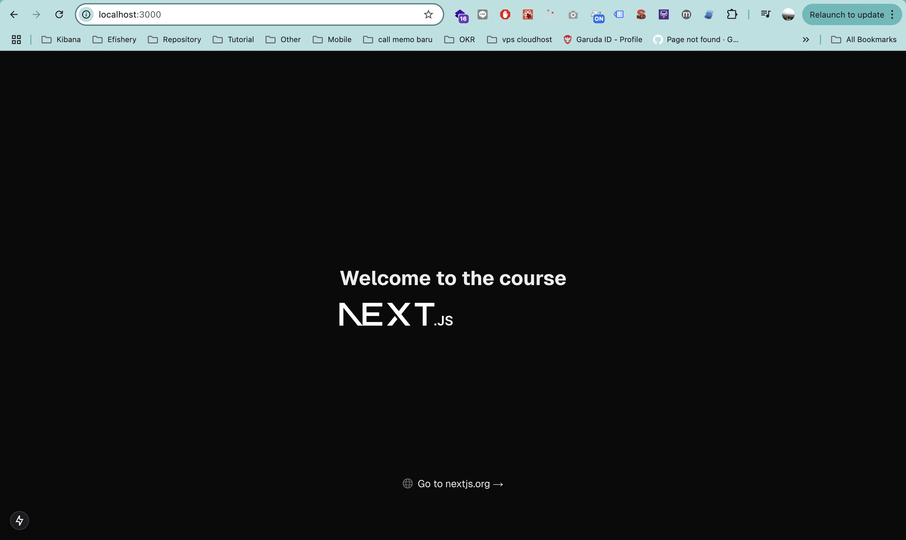

## Introduction to YARNIT 🧶

Hello! It'm me Nabiilah Putri Safa , I'm currently working on this Next.js projcet called YARNIT (ㅅ´ ˘ `). 


YARNIT is a website for those who loves anything to do with yarns, whether it is crocheting, knitting, or even embroidering! We provides features like:

- Yarn Shopping
- Pattern Shopping
- Workshops
- Viral Trends
- Community Finder
- ,etc.

Hopefully I can finish this little project of mine ASAP ദ്ദി ˉ͈̀꒳ˉ͈́ )✧ .

Xoxo,
Naput ❤︎

<!-- - First, Clone this repository ✅
- Run command `npm install` or `yarn install` for install dependencies and wait until it's finished
- After that, you can run the development server: -->

<!-- ```bash
npm run dev
# or
yarn dev
# or
pnpm dev
# or
bun dev
``` -->

<!-- - And can view the results through a browser
  

## Stack this project 🕸️

- Nextjs (Pages Router) ✅
- React ✅
- Eslint ✅
- Prettier ✅
- Typescript ✅ -->

<!-- ## Custom VScode Settings

The configuration below can be viewed through the root folder `.vscode/settings.json`

```json
{
  "editor.formatOnSave": true,
  "editor.defaultFormatter": "esbenp.prettier-vscode",
  "[javascript]": {
    "editor.defaultFormatter": "esbenp.prettier-vscode"
  },
  "[typescript]": {
    "editor.defaultFormatter": "esbenp.prettier-vscode"
  },
  "[typescriptreact]": {
    "editor.defaultFormatter": "esbenp.prettier-vscode"
  },
  "[javascriptreact]": {
    "editor.defaultFormatter": "esbenp.prettier-vscode"
  },
  "eslint.format.enable": true,
  "eslint.lintTask.enable": true,
  "eslint.validate": [
    "javascript",
    "typescript",
    "typescriptreact",
    "javascriptreact"
  ]
}
``` -->
